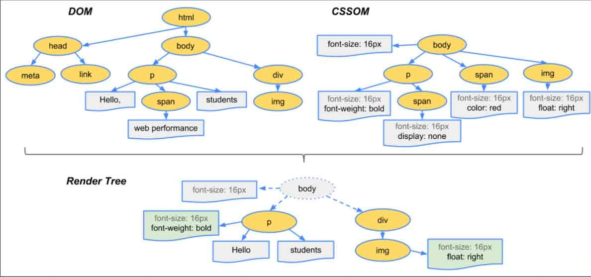

# CSS动画
## 1. 动画原理
- 帧的概念：可以将帧理解成图片,一秒钟的动画由24帧连贯的图片组成,帧数越高画面动作越细腻.

## 2. 浏览器的渲染原理
- 步骤
1. 会根据HTML构建HTMLDOM
2. 根据CSS构建CSSOM
3. 将先两者合并成一个预渲染树(render tree)
4. Layout布局
5. Paint绘画(渲染出css样式)
6. Compose合成(根据层叠上下文关系展示页面)
(下面图片来自于饥人谷前端课程)


 
 ## 3.  CSS动画优化
 1. 使用requestAnimstionFrame 替代 setTimeout 或 setInterval
 2. 使用 will-change 或 translate
 3. 使用 transform:translate 替代 position:absolute;left:0
 
 ## 4.  transform动画属性
 常用功能
 - translate 位移
 	- translateX
 	- translateY
 	- translateZ
 

```css
//技巧:可以利用对绝对元素的居中
.container{
	position:relative
}
.div{
	position:absolute;
	left:50%;
	top:50%;
	transform:translate(-50%,-50%)
}
```

 - scale 缩放
 	- scale(倍数)
 	- scaleX
 	- scaleY
 - rotate 旋转
 	- rotate(45deg)
 	- rotateX()
 	- rotateY()
 - skew 倾斜
 	- skewX(15deg)
 	- skewY(15deg)
 

## 5. transition过度属性
 transition又称之为补间动画
- 语法
- `transition:属性名 时长 过度方式 延迟`
- `transition:left 20ms , top 400ms //可以用逗号分隔两个不同的属性`
- `transition:all 200ms //可以用all代表所有属性`
- `过度方式: linear | ease | ease-in | ease-out | ease-in-out` 
- 注意:**不是所有属性都有过度,例如display:none**

## 6.  animation关键帧动画
- 语法一

```css
.div{
	animation: div 5s;
}
@keyframes div{
	from:{
		transform:translateX(0%)
	}
	to{
		trandform:translateX(100%)
	}
}
//或者
@keyframes div{
	0%{
		top:0;
		left:0
	}
	30%{
		top:50px
	}
	40%,50%{
		left:50px
	}
	100%{
		top:100px
	}
}
```
#### 6.1  缩写语法
- `animation:时长 | 过度方式 | 延迟 | 次数 | 方向 | 充填模式 | 是否暂停 | 动画名"`
- `过度方式: 和transition取值一样`
- `次数: 3 或2.4或infinite`
- `方向: reverse | alternate | alternate-reverse`
- `填充模式: none | forwards | backwards | both`
- `是否暂停: paused | running`