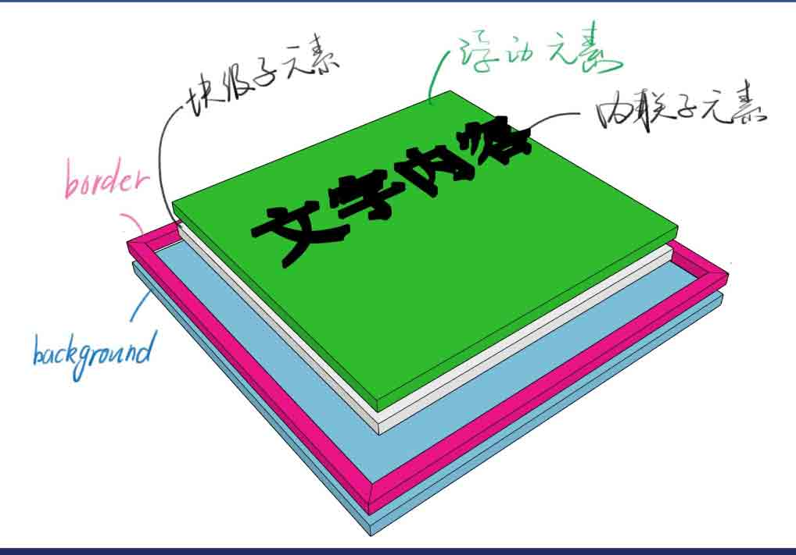
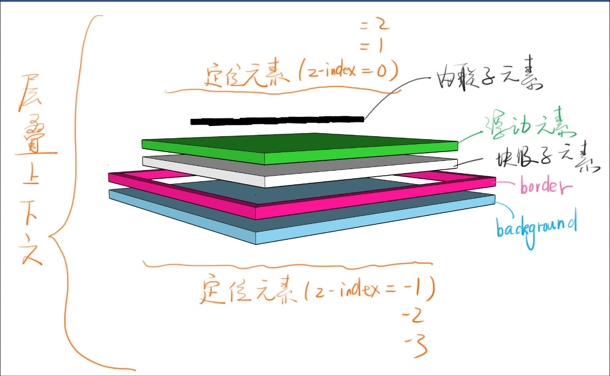

# css定位
## 1.元素分层
以background为例子

```css
body{
	border:20px solid red;
	background:#bbb;
	width:200px;
	hieght:200px;
}
```
如上面的样式所示,body的背景会在边框的下面,且宽度和高度为200px;如下图所示
(下面图片资源来自饥人谷前端系统课程)



## 2.1 position:relative
#### 使用场景
- 用于做位移(不会脱离文档流--原始位置会被站位)
- 用于给adsolute元素做父级使用

```css
	div{
		position:relative
	}
```
## 2.2 position:absolute
#### 使用场景
- 脱离原来的位置,另起一层(脱离文档流);比如关闭按钮
### 经验
- adsolute是相对于祖先元素中最近的定位元素进行相对的定位
- 部分浏览器不加top/left会错乱,***推荐使用两个属性定位***
- 推荐使用:left:100%
- 推荐使用 left:50%;加负margin

## 2.3 position:fixed
#### 场景
- 用于广告窗口(相对于浏览器视口进行定位)
- 回到顶部按钮
#### 缺点
- ***手机上使用fixed会出现连带BUG***

## 2.4 position:sticky
#### 描述
- 粘滞定位
#### 场景
- 用于官网首页的导航栏,到达一定高度会置顶显示
#### 缺点
主流浏览器还不支持 IE>=11

## 层叠上下文
(下面图片来自饥人谷前端系统课程)

#### 描述
- 每一个层叠上下文就是一个新作用域
- 在局部作用的z-index和外界无关,只用在相同作用域下才有层叠比较

#### 注意
z-index / flex / opacity / transform都会创建层叠上下文 


