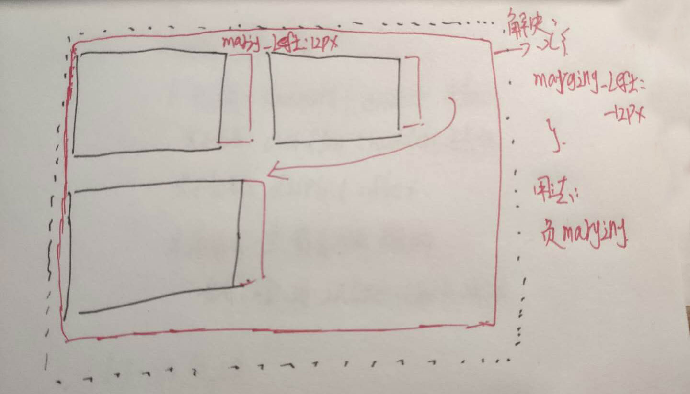

# CSS布局
## 布局分类
1. 固定宽度的布局,一般宽度为960/1000/1240px 例如:淘宝网
2. 不固定宽度布局,主要靠文档流的原理来布局

##  float布局(浮动布局)
使用
- 在子元素上加float:left/right 和width
- 在父元素上加 .clearfix

```css
.clearfix::after{
	contern:'';
	display:block;
	clear:both
}
```
***float中存在的问题***

 - [ ] IE6/7存在双倍的margin情况,解决办法
 	- 方法一: 针对6/7把margin减半
 	- 方法二: display:inline-block
 - [ ]  利用float布局统一存在的外边距,导致最后一个div元素换行
 	- 解决方法: 在元素集的上一级添加div margin设置成子元素的margin*-1;也称为 ***负margin***
  
