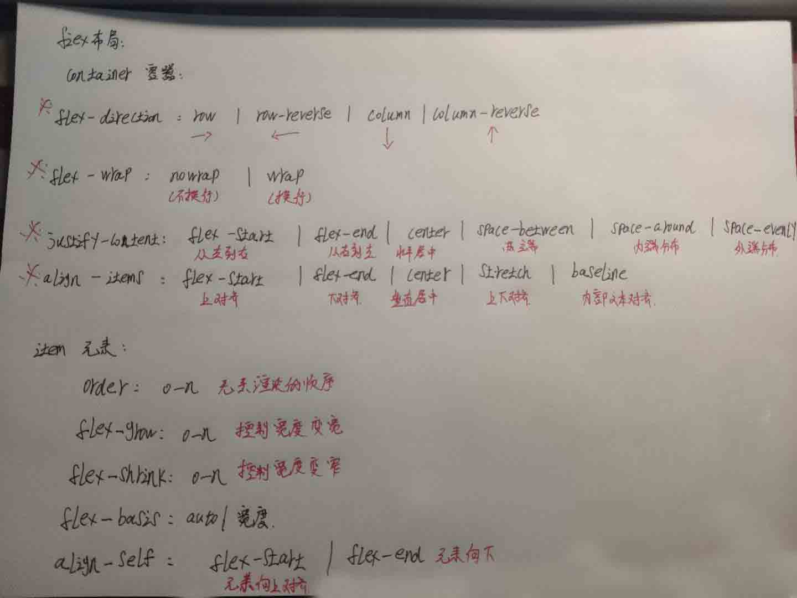

# CSS布局(二)
## Flex布局

##  布局建议
- 非特殊情况下不要把width/height的值写死
- 推荐使用使用 min-width/max-width/min-height/max-height
- flex 和 margin-xxx:auto 配合会有意外的效果
- 宽高单位推荐
	- width:50%
	- max-width:100px
	- width:30vw //占屏幕宽度的30%最高100vw
	- min-width:80%
	- 特点: 尽量不使用px,或者加min max前缀