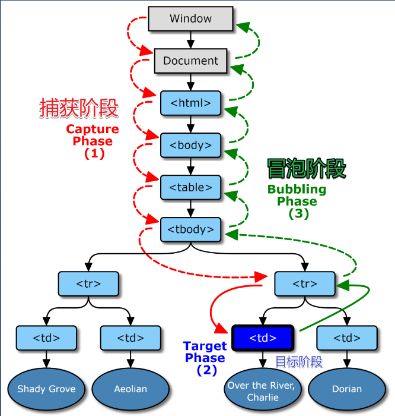

## DOM事件模型
   1. DOM事件
   2. DOM事件流
   3. 什么是捕获
   4. 什么是冒泡
   5. event参数
   6. 捕获和冒泡的先后顺序是怎样的
   7. 如何取消冒泡
   8. 如何自定义事件

### 1.DOM事件
DOM是JavaScript有能力对HTML的事件做出反应,这些事件包括鼠标键盘的点击事件、移动时间以及页面中的变化等。html元素事件是浏览器内在自动产生的，当有事件反发生时HTML元素会向外界发出各种事件，如click。onmuseover，onmuseout等。

### 2.事件流
DOM的结构是一个树形,每当html元素产生事件是,该事件就会在树的根节点和元素节点之间传递,所有经过的节点都会收到该事件.

### 3.什么是捕获
从外向内找监听函数,叫事件捕获

``` javascript
    element.addEventListener('事件名',fn,[true])
```

### 4.什么是冒泡
从内向外找监听函数,叫事件冒泡
``` javascript
    element.addEventListener('事件名',fn,[false]) // 第三个参数默认false
```
### 5.event
``` javascript
    div.addEventListener("事件名",fn(e){},[false])
```
所有事件当被触发函数时都会返回一个event参数,提供事件信息

e.target VS e.currentTarget
e.target - 用户操作的元素
e.currentTarget - 程序员监听的元素
* this是e.currentTargert 不推荐使用this取代e.currentTarget
举例:
    div>span{文字} ,用户点击文字
    e.target就是span
    e.currentTarget 就是 div

### 6.捕获和冒泡的先后顺序是怎样的
 (图片来自饥人谷)
正常情况下先执行事件捕获然后执行事件冒泡

#### 6.1 特殊示例
背景: 如果只有一个div被监听 (不考虑父子同时被监听);fn分别在捕获阶段和冒泡阶段监听click事件,谁先被执行
答案: 谁的监听在前谁前被监听

### 7. 如何取消冒泡
e.stopPropagation()
//提示
Bubbles 表示事件是否冒泡
Cancelable 表示开发者是否可以取消冒泡

### 8. 如何自定义事件
``` html
    <div id="but">点击</div>
```
``` javascript
    but.addEventListener('click',()=>{
        const event = new CustomEvent('test',{
            {'data':{name:'hello world'}}
        })
        but.dispatchEvent(event)
    })
    but.addEventListener("test",(e)=>{
        console.log(e) 
    })
```

