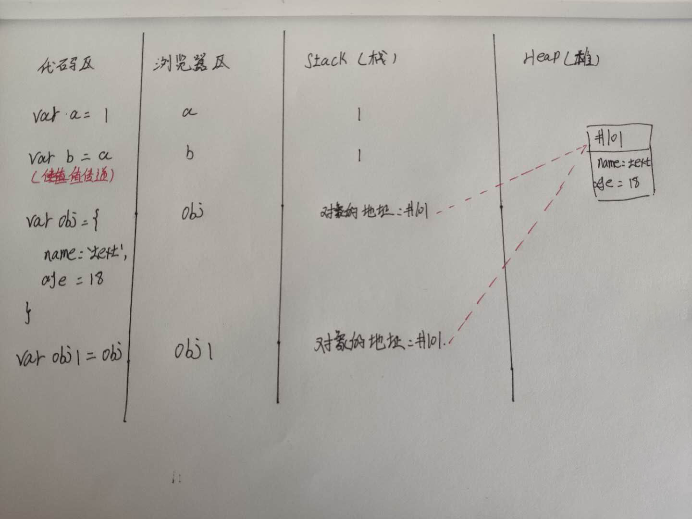
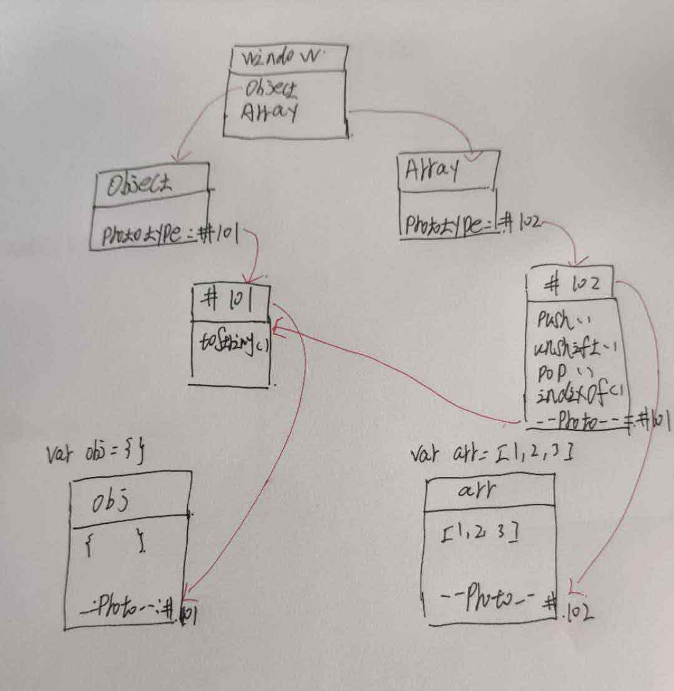

# JS世界
## 1. 浏览器的功能
- 发起请求 , 下载HTML,解析HTML,下载CSS,解析CSS,渲染界面,下载JS,解析JS,执行JS等
- 功能模块: 用户界面、渲染引擎、JS引擎、存储等
- 功能模块一般处于不同的线程中（比进程小）
- 一般情况打开浏览器会在内存中创建一个进程，每个页面窗口会创建多个子进程，子进程下面是功能模块的线程（同域名情况可能会产生一个子进程）

## 2. JS引擎的主要功能
- 编译: 把JS代码翻译为机器能执行的字节码或机器码
- 优化: 改写代码,使其更高效
- 执行: 执行上面字节码或机械码
- 垃圾回收: 把JS用完的内存回,方便之后再次使用

## 3. 执行JS代码
- 提供API:window/document/steTimeout都是浏览器提供的功能,不是JS自身具备的功能.

## 4.JS内存图
如下图所示

Stack和Heap
- Stack:
	- 每个数据顺序存放
	- 主要存放非对象 如number\string\bool
- Heap
	- 每个数据随机存放
	- 主要存对象(除 number\string\bool之外都算对象)

如上图所示
```javascript
	var obj={
		name:'text',
		age:18
	};
	var obj1 = obj;
	obj.age = 22;
	console.log(obj.age) // 22
	console.log(obj1.age) //22
```
因为obj1赋值的是obj的对象地址,两个变量的地址指向同一个对象堆,所以改变对象会被改变

## 5. 原型链
如下图所示

prototype和__proto__的区别
- prototype 是挂在函数上的
- __porto__是挂在新生成的对象上的