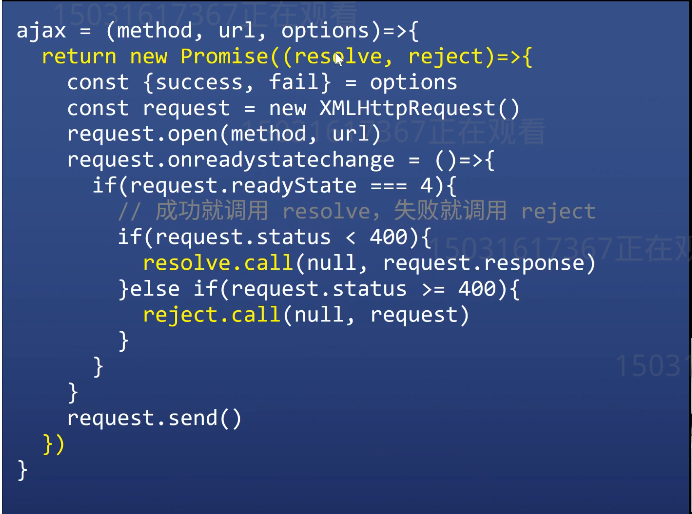

# 同步与Promise
1. 什么是同步和异步
2. 异步的实现方式
3. 异步的API有哪些
4. 异步的问题总结
5. promise的优势
6. promise的基本用法
7. 面试题

## 1. 同步&&异步
同步
以生活中的场景为例,小明去一个餐厅吃饭需要排号取餐,而在这个排队的过程中小明后面所有的事情都必须等到排队完成才能去做.

异步
还是以小明排队取餐的例子,小明可以取完号码后,可以去逛个街等号码读到他了在来取;
那么怎么通知小明来取餐呢?

## 2. 异步实现的方式
1. 可以每过几分钟回来问一次是不是可以取餐了(轮询法)
2. 把微信给商家,好了微信告诉我 (回调) 最常用

## 3. 异步的API有哪些
1. setTimeout
2. AJAX
3. AddEventListener
4. ...

## 4. 异步的问题总结
   1.异步任务不能拿到结果,于是我们传一个回调给异步任务.异步任务完成时调用回调,调用的时候把结果作为参数.
   上代码
   ``` javascript
    function fn(x){ 
        console.log(x)
    }
    function test(a){
        setTimeout(()=>{
            a("123")
        })
    }
    test(fn)
   ```
   上面的代码表示 fn函数作为test的回调函数,通过test(fn)传参的方式在内部被调用

   2.如果异步任务有两个结果成功或是失败,怎么办
    方法一: 回调接受两个参数
    ```javascript
        fs.readFile('./1.text',(error,data)=>{
            if(error){console.log(error);return} //失败
            console.log(data)
        })
    ```
    方法二: 两个对调函数
    ``` javascript
        ajax("get",'/1.json',(data)=>{},(error)=>{})
    ```

    缺点:
    1. 回调参数规范
    2. 回调地狱
    3. 很难进行错误处理

## 5. Promise的优点
 为了解决上述异步的问题,ES6推出了Promise语法
 优点:
    1. 规范回调的名字和顺序 (resolve,reject)
    2. 拒绝回调地狱,使代码的可读性更强
    3. 方法的捕获错误

## 6. Promise的基本用法
    基本语法
    ``` javascript
        return new Promise((resolve,reject)=>{})
        // resolve 成功
        // reject 失败
        //使用 .then(success,fail) 传入成功和失败函数
    ```

    特点
     Promised的成功回调和失败回调都只能接受一个参数,成功在前失败在后
     示例
     ``` javascript
        ajax("get",'/1.json').then((response)=>{成功},(request)=>{失败})
     ```
     

## 7. 面试题
``` javascript
    [‘1’,’2’,’3’].map(parseInt) // 1,nan,nan

    等效于:
    [‘1’,’2’,’3’].map((item,index,arr)=>{
        return parseInt(‘1’,0,[‘1’,’2’,’3’])
        //  parseInt(‘1’,0) 只接受两个参数,忽略第三个参数
        //  parseint(‘2’,1) 第二各参数表示进制,把2当做一进制的数解析所以 NAN

    })

```

 


