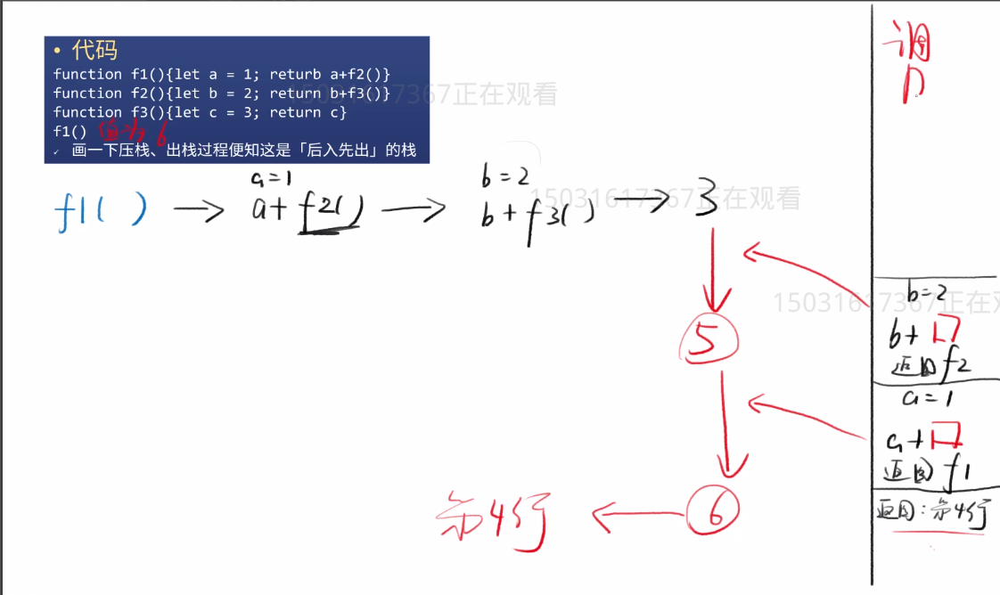

# 数据数据解构
1. 队列 & 栈
2. 链表
3. 哈希表
4. 树

## 1. 队列(Queue) & 栈
- 队列
  - [先进先出FIFO]的数组
  - 场景
    - 餐厅叫号
  - push进栈 unshift出栈
  
[实例代码移步github](https://github.com/gongjianOnline/dataStructure/tree/master/%E9%98%9F%E5%88%97%26%E6%A0%88/%E9%98%9F%E5%88%97)
- 栈
  - [后进先出]的数组
  - 场景
    - 封闭式电梯
``` javascript
    function fn1(){
        let a = 1
        return a + fn2()
    }
    function fn2(){
        let b = 2
        return b + fn3()
    }
    function fn3(){
        let c = 3
        return c
    }
    console.log(fn1()) 
```
如上代码执行的执行的过程是


## 2. 链表
- 一个对象连接和另一个对象
- 场景
    - 原型链的模式
- 可对链表进行增删改查(利用递归)


## 3. 哈希表
- 用于存一个key-value的键值对
- 存的数据越多,读的时间越长(优化方法:key推荐排序存储)

## 4.树
- Tree
  - 一个链多个
  - 场景
    - 中国县级市
    - 网页的节点
- 可以和链表一样进行增删改查(利用递归)


